# Se7ety (صحتي) 🩺

A premium, modern Healthcare Application built using **Flutter** and **Dart**. Se7ety provides a comprehensive platform for managing doctor-patient interactions, appointment scheduling, and professional medical profiles.

---

## 🚀 Features

### For Patients

- **Smart Search**: Find doctors by name or browse through various specializations.
- **Top Rated Doctors**: Discover high-quality medical care through a real-time rating system.
- **Appointment Booking**: Simple and intuitive flow to manage your health schedule.
- **Beautiful Dashboard**: A personalized home screen with a modern navigation bar.

### For Doctors

- **Professional Profile**: Complete your registration with clinic details, bio, and work hours.
- **Cloud Profile Image**: Seamless image upload and hosting using Cloudinary integration.
- **Identity Management**: Secure authentication and role-based access.

---

## 🛠️ Technology Stack

- **Framework**: [Flutter](https://flutter.dev) (Latest Version)
- **State Management**: [Flutter Bloc](https://pub.dev/packages/flutter_bloc) (Cubit)
- **Backend**: [Firebase](https://firebase.google.com) (Auth, Firestore)
- **Image Hosting**: [Cloudinary](https://cloudinary.com)
- **Navigation**: [GoRouter](https://pub.dev/packages/go_router)
- **Localization**: [Easy Localization](https://pub.dev/packages/easy_localization) (Full Arabic Support)
- **UI Components**:
  - `google_nav_bar` (Modern Bottom Navigation)
  - `smooth_page_indicator` (Onboarding Dots)
  - `lottie` & `flutter_svg` (Animations and Icons)

---

## 📸 Screenshots

### 🗺️ Application Flow

|                 Splash Screen                  |                 Welcome Screen                  |
| :--------------------------------------------: | :---------------------------------------------: |
| 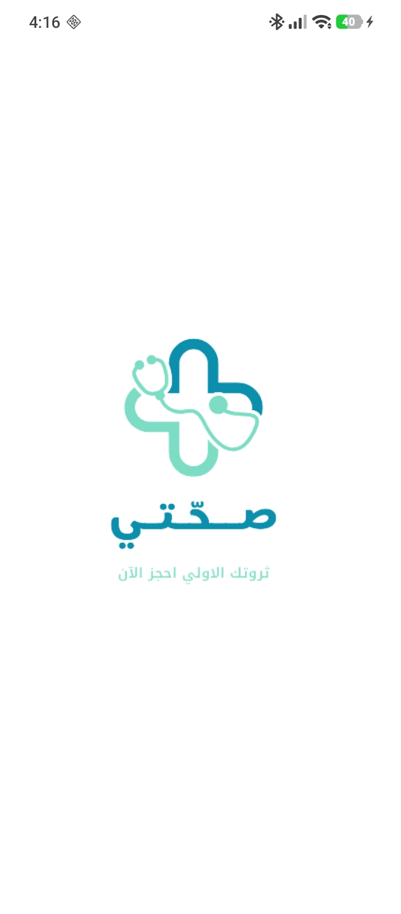 | 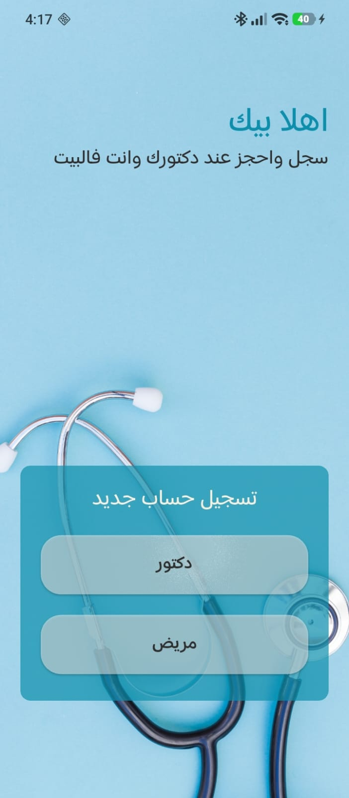 |

### 📖 Onboarding Experience

|                    Onboarding 1                    |                    Onboarding 2                     |                    Onboarding 3                     |
| :------------------------------------------------: | :-------------------------------------------------: | :-------------------------------------------------: |
| 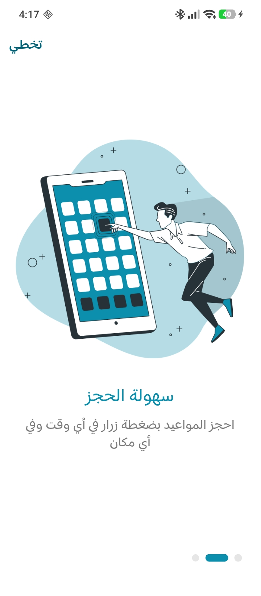 | 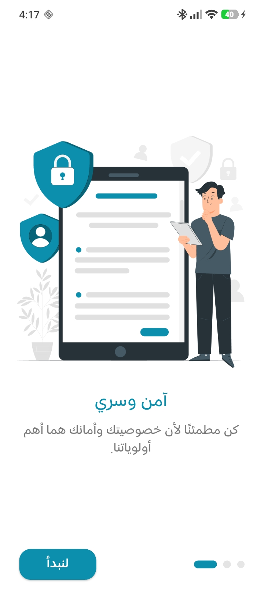 | 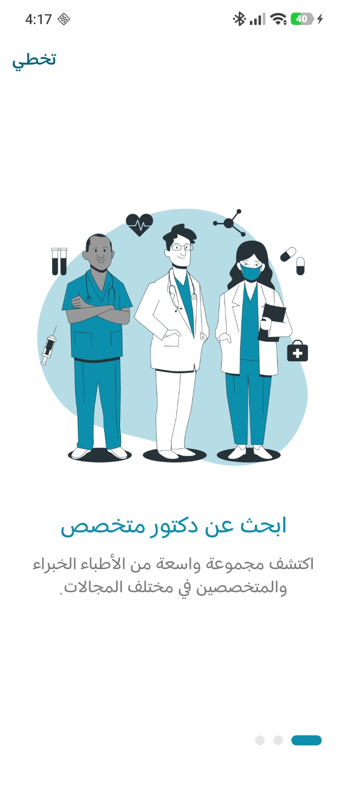 |

### 🔐 Authentication Flow

|                     Login                     |                 Advanced Login                 |                     Register                     |
| :-------------------------------------------: | :--------------------------------------------: | :----------------------------------------------: |
| 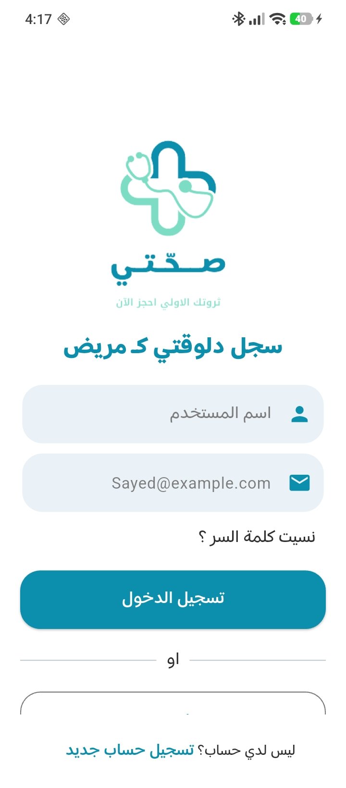 | 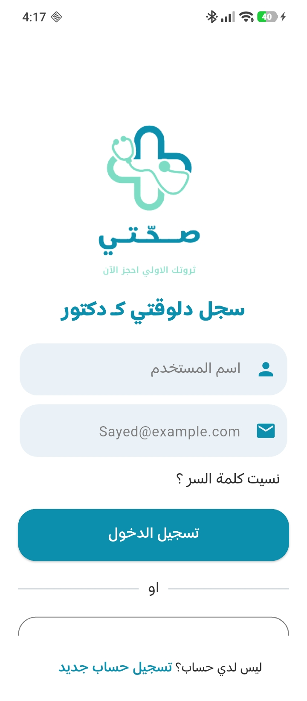 | 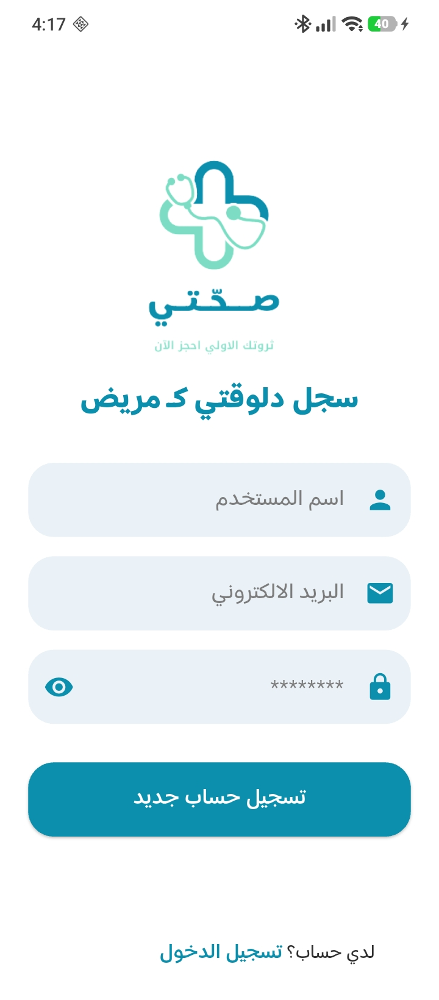 |

### 🏠 Patient Dashboard & Search

|                Home Dashboard                |             Specialization Search             |
| :------------------------------------------: | :-------------------------------------------: |
| 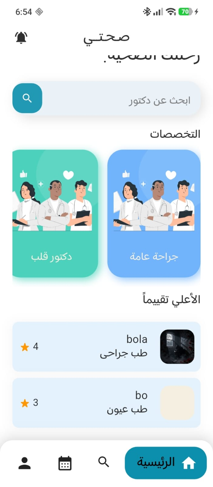 | 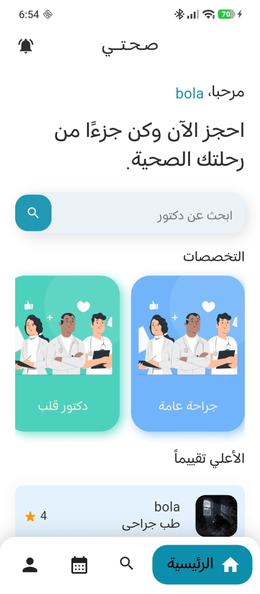 |

### 👨‍⚕️ Doctor Profile Complete

|                         Step 1: Details                         |                       Step 2: Confirmation                       |
| :-------------------------------------------------------------: | :--------------------------------------------------------------: |
| 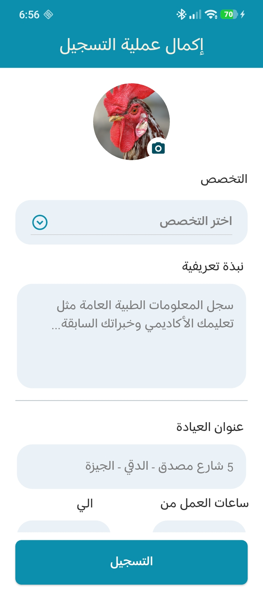 | 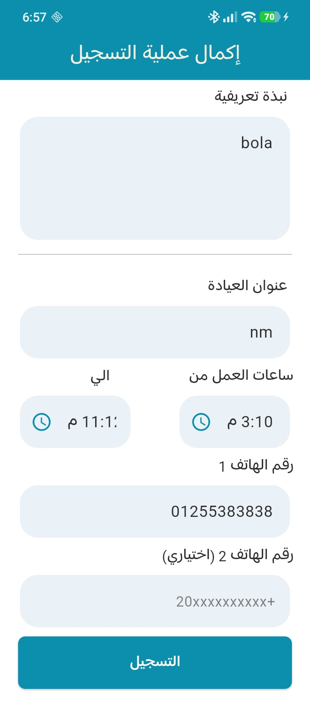 |

---
